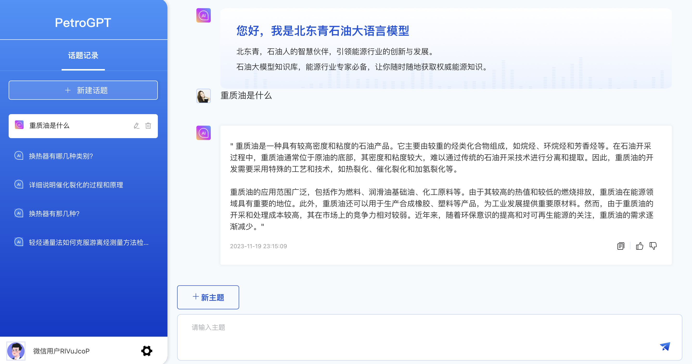

<div align="center">

<p align="center">
  
</p>

**PetroGPT石油大模型**

**石油人的智慧伙伴，引领能源行业的创新与发展**

[](LICENSE)
[](https://github.com/PetroGPT/PetroGPT/master)


</div>

PetroGPT是石油行业中文大语言模型。基于160万条石油领域数据进行训练优化，语料覆盖地质勘探、石油工程、油气储运、石油化工四大石油生成过程。

##  最新动态

* [2023-12-29] PetroGPT 1.0版本发布，提供高精度石油生成大模型。
  * 基于Baichuan2-7B-Chat模型，基于石油领域大数据进行LoRA微调

##  特性

* **高精度**：

* **高可用性ß**：

##  使用说明
### 环境安装
首先需要下载本仓库：
```shell
git clone https://github.com/PetroGPT/PetroGPT
cd PetroGPT
conda create -n petrogpt python=3.10
conda activate petrogpt
pip install -r requirements.txt -i  https://pypi.tuna.tsinghua.edu.cn/simple 
pip install -e .
```


### 代码调用 

可以通过如下代码调用 PetroGPT 模型来生成对话：

```python
>>> from transformers import AutoTokenizer, AutoModel
>>> tokenizer = AutoTokenizer.from_pretrained("****/***", trust_remote_code=True)
>>> model = AutoModel.from_pretrained("****/***", trust_remote_code=True, device='cuda')
>>> model = model.eval()
>>> response, history = model.chat(tokenizer, "重质油是什么", history=history)
>>> print(response)
" 重质油是一种具有较高密度和粘度的石油产品。它主要由较重的烃类化合物组成，如烷烃、环烷烃和芳香烃等。在石油开采过程中，重质油通常位于原油的底部，其密度和粘度较大，难以通过传统的石油开采技术进行分离和提取。因此，重质油的开发需要采用特殊的工艺和技术，如热裂化、催化裂化和加氢裂化等。

重质油的应用范围广泛，包括作为燃料、润滑油基础油、化工原料等。由于其较高的热值和较低的燃烧排放，重质油在能源领域具有重要的地位。此外，重质油还可以用于生产合成橡胶、塑料等产品，为工业发展提供重要原材料。然而，由于重质油的开采和处理成本较高，其在市场上的竞争力相对较弱。近年来，随着环保意识的提高和对可再生能源的关注，重质油的需求逐渐减少。"
```

### web体验
为了方便用户直接使用，我们提供了[体验网址](petrogpt.cn)


<p align="center">
  
</p>


## 数据集说明

数据生产方式


## 后续开发计划

- 1、增加石油计算功能
- 2、持续优化扩充数据集xxxx


